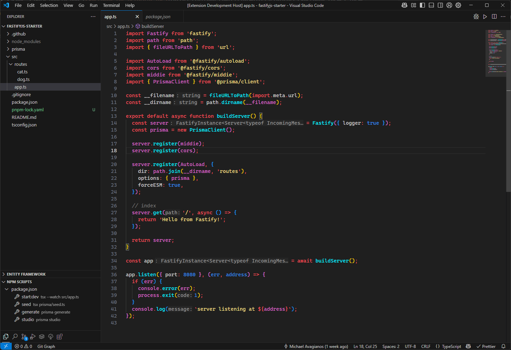

# CyberModern Theme

A mix of VSCode's Dark Modern and [Cyberpunk for JetBrain IDEs](https://github.com/elliotwaite/jetbrains-cyberpunk-theme) Theme.

This theme only changes the text editor's theme, not the UI.

## Screenshot

## Color inspiration

- [JetBrains Cyberpunk Theme](https://github.com/elliotwaite/jetbrains-cyberpunk-theme): A theme for JetBrains IDEs (PyCharm, IntelliJ, etc.) inspired by Cyberpunk 2077.

### License

[MIT](LICENSE)
